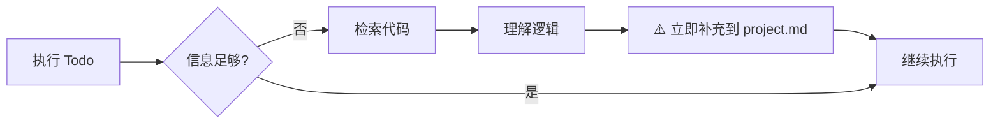

# 上下文记忆系统 - 详细示例

> 本文档包含 `common-rules.md` 中核心规则的详细示例和说明。

---

## 背景问题

在与 AI 交流复杂任务时,常见的问题包括:
- **易失性记忆** — 上下文重置时,之前的进度和决策会丢失
- **目标漂移** — 在多次工具调用后,原始目标容易被遗忘
- **信息过载** — 所有内容挤在上下文中,降低性能并增加成本
- **工具碎片化** — 不同编辑器/AI 工具的配置方式不同,难以统一

---

## 任务进行中禁止退出 - 详细示例

### 场景 1: 用户说"先测试"

**❌ 错误做法:**
- 退出 FlowMem 流程
- 直接运行测试命令

**✅ 正确做法:**
1. 更新 todolist.md,标记当前 Todo 为 [x]
2. 在「执行日志」中记录:"用户要求先测试,暂停后续 Todo"
3. 执行测试(测试也需遵循规则 4,先更新 todolist.md 再执行)
4. 测试完成后,更新 todolist.md 记录测试结果
5. 询问用户是否继续后续 Todo
6. 根据用户回复更新 todolist.md 状态

> ⚠️ **关键**: 任务内的所有操作(包括测试、检查等)都需要遵循文档更新规则,不能因为是"临时操作"就跳过更新。

### 场景 2: 用户提出不相关需求

如果用户的回复明显与当前任务无关(例如:正在做支付模块,用户突然问"帮我写个排序算法"),**必须先确认**:

```markdown
检测到您的需求与当前任务「[request.md 中的任务名]」似乎不相关。

请确认:
1. 这是当前任务的一部分吗?(如果是,我会在 todolist.md 中补充)
2. 还是一个新的独立任务?(如果是,我会先归档当前任务)
```

**只有用户明确表示是新任务**,才能归档当前任务并退出。否则将其作为当前任务的一部分处理。

---

## 规则 2: 刷新上下文 - 详细说明

### 5 步详细流程

1. **读取当前 Todo**（`todolist.md`）:明确当前要做什么
2. **读取需求目标**（`request.md`）:确保理解用户的真实意图
3. **读取项目背景**（`project.md`）:补充必要的项目认知
4. 如发现信息不足,检索代码/文档
5. **立即补充**新知识（遵循"索引优先"原则）

> 💡 **优先级说明**: Todo 和 Request 决定"做什么",Project 提供"怎么做"的背景

### 何时拆分到 docs/

- 单个模块说明超过 50 行
- project.md 总长度超过 300 行
- 包含大量代码示例或配置细节

### 索引优先原则示例

```markdown
# project.md 中只写索引
## 支付模块
负责订单支付与退款处理 → [详细](docs/modules/payment.md)

# request.md 中只写摘要
## 澄清要点
- 不需要分账功能 → [对话详情](request_detail/dialog_round1-5.md#分账讨论)
- 退款时效要求 3 天 → [对话详情](request_detail/dialog_round3-5.md#退款讨论)
```

### project.md 设计原则详解

> **核心目标**:让 AI 快速理解项目的三个维度:
> 1. **是什么** — 项目定位、核心业务逻辑
> 2. **怎么做** — 技术栈、架构设计、关键流程
> 3. **怎么改** — 约定规范、注意事项

- **渐进式增长**:初始版本只需基础信息,随任务执行动态补充
- **索引优先**:大型项目采用"主文档 + 详细文档"模式,按需加载
- **知识沉淀**:每次任务中检索到的通用知识都应补充进来

---

## 规则 3: 需求澄清 - 详细约束

### ⚠️ 关键约束

- 每次用户回复后,**禁止直接开始执行任务**
- 必须先将用户的回复内容更新到 `request.md` 对应的澄清对话记录中
- 用户最终确认后,必须先更新 `request.md` 顶部状态标记(如 `> **状态**:✅ 已确认`)
- 只有完成上述更新后,才能生成 `todolist.md`

### 拆分阈值

对话超过 **5 轮** 或文档超过 **150 行**,将对话原文拆分到 `request_detail/`

### 需求确认后自检示例

```markdown
## 自检结果
- [x] 需求描述完整无矛盾
- [x] 技术方案可行
- [ ] 验收标准不够明确 ← 需补充
```

---

## 规则 4: 单步执行 - 详细示例

### 执行流程详解

1. 执行当前 Todo 项
2. **完成后必须立即更新 `todolist.md`**:
   - 标记当前项为 `[x]`
   - 记录执行结果到「执行日志」部分
   - 将下一项标记为 `[/]`(进行中)
3. **更新完成后才能继续下一个 Todo**

### 🚨 禁止行为详解

- ❌ 完成 Todo A 后直接开始 Todo B,不更新 todolist.md
- ❌ 一次性执行多个 Todo 项后才统一更新状态
- ❌ 在心里记住"待会儿更新",先继续执行下一个任务

---

## 规则 6: 知识沉淀 - 详细说明

### 补充规则（防止 project.md 膨胀）

1. 只补充**通用性知识**（其他任务也可能用到的）
2. 任务特定的临时信息放 `notes.md`,不污染 `project.md`
3. 补充时遵循「索引优先」原则:简短摘要 + 详细文档链接

### 🚨 禁止行为详解

- ❌ 检索到重要信息后心里记住,打算"待会儿补充"
- ❌ 完成多个 Todo 后才统一补充知识到 project.md
- ❌ 只在对话中提到发现,但不写入文档

---

## 规则 7: Manus 4 原则详解

| 原则 | 说明 | 实践 |
|------|------|------|
| **仅追加上下文** | 永不修改之前的消息,避免 KV 缓存失效 | 新信息始终追加,不回头修改历史 |
| **稳定前缀** | 将静态内容放最前面,提高缓存命中率 | 系统指令 → 项目背景 → 动态内容 |
| **避免过拟合** | 不要盲目复制重复的操作模式 | 稍微改变措辞,对重复任务重新校准 |
| **可逆压缩** | 压缩的信息必须能还原 | 存储路径而非删除,需要时可"查找" |

---

## 规则 8: 任务清理 - 详细说明

### 归档操作详解

| 操作 | 文件 | 说明 |
|------|------|------|
| 归档 | `request.md` → `history/[日期]_request_xxx.md` | 保留完整记录 |
| 归档 | `request_detail/` → `history/[日期]_request_detail/` | 对话详情一并归档 |
| 归档 | `todolist.md` → `history/[日期]_todolist_xxx.md` | 保留执行记录 |
| 删除 | `notes.md` | 任务特定信息不再需要 |
| 保留 | `project.md` 和 `docs/` | 长期知识库保留 |

---

## 关键设计点

| 设计点 | 说明 |
|--------|------|
| **渐进式理解** | 首次进入只需大概了解项目,不要求完整认知 |
| **按需检索** | 执行任务时发现信息不足,再去检索代码/文档 |
| **动态积累** | 检索到的知识**立即补充**到 `project.md`,形成知识沉淀 |
| **多轮澄清** | `request.md` 承载需求的多轮交流,**每次用户回复后立即更新文档** |
| **单步执行** | 每次只执行一个 Todo,**完成后立即更新 todolist.md 状态** |

---

## 知识检索与补充流程



---

## 错误恢复模式

### ❌ 错误做法

```
行动: Read config.json
错误: File not found
行动: Read config.json  # 静默重试...
```

### ✅ 正确做法

```
行动: Read config.json
错误: File not found

# 更新 todolist.md:
## 遇到的问题
- 未找到 config.json → 将创建默认配置

行动: Write config.json (创建默认配置)
成功！
```

> 💡 错误恢复是真正 agentic 行为最清晰的信号之一。

---

## 循环模式详解

### 模式选择标准

- **开发模式**:目标是产出代码、修改文件或实现功能。
- **研究模式**:目标是回答问题、调研方案或排查未知根因（Bug 修复的前半段）。

> 💡 **关键洞察**:每次循环开始前都要读取计划文件,确保目标保持在注意力窗口内。

---

## Manus 关键数据

> 以下数据来自 Manus AI 的公开分享,证明上下文工程的价值。

| 指标 | 数值 | 说明 |
|------|------|------|
| 每次任务平均工具调用 | ~50 次 | 需要持久化机制防止目标漂移 |
| 输入输出 Token 比 | 100:1 | Agent 是输入密集型,每个 Token 都有成本 |
| 上下文刷新频率 | 每次决策前 | 在注意力窗口末尾读取计划文件 |
| 收购价格 | 20 亿美元 | 证明上下文工程的商业价值 |
| 实现 1 亿营收时间 | 8 个月 | 从发布到盈利的速度 |

> 💡 **关键洞察**:通过在每次决策前刷新计划,目标始终保持在注意力窗口内。这是 Manus 能处理约 50 次工具调用而不丢失进度的秘诀。
