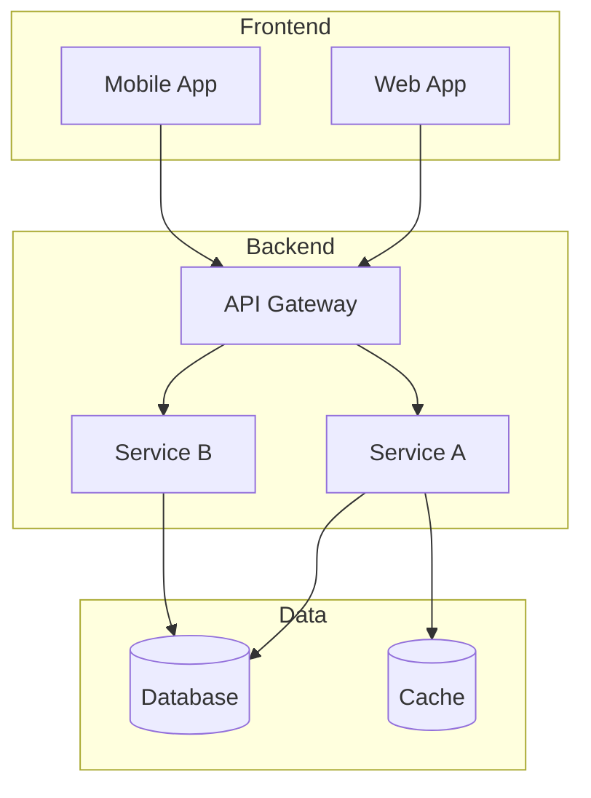
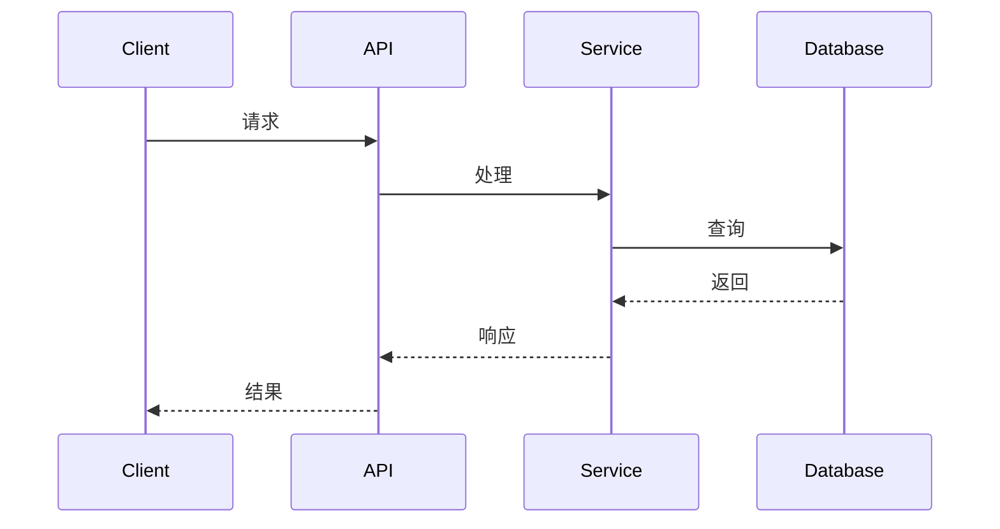

# 系统架构文档模板

> 记录项目的技术架构和设计决策

---

## 架构概览

---

## 技术栈

| 层级 | 技术 | 说明 |
|------|------|------|
| 前端 | [如 React] | [选择原因] |
| 后端 | [如 Node.js] | [选择原因] |
| 数据库 | [如 PostgreSQL] | [选择原因] |
| 缓存 | [如 Redis] | [选择原因] |
| 部署 | [如 Docker] | [选择原因] |

---

## 核心模块

| 模块 | 职责 | 详细文档 |
|------|------|----------|
| [模块1] | [职责] | [modules/xxx.md](modules/xxx.md) |
| [模块2] | [职责] | [modules/yyy.md](modules/yyy.md) |

---

## 数据流

---

## 设计决策

### 决策 1: [决策标题]

**背景**：[为什么需要做这个决策]

**选项**：
1. [选项A] - [优缺点]
2. [选项B] - [优缺点]

**结论**：选择 [选项X]，因为 [原因]

---

## 扩展性考虑

| 场景 | 当前方案 | 扩展方案 |
|------|----------|----------|
| [场景1] | [当前] | [扩展] |
| [场景2] | [当前] | [扩展] |

---

## 相关文档

- [business-logic.md](business-logic.md) - 业务逻辑
- [data-models.md](data-models.md) - 数据模型
