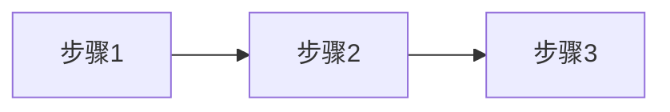

# 业务逻辑文档模板

> 记录项目的核心业务流程和规则

---

## 概述

[2-3 句话描述项目的核心业务]

---

## 核心流程

### 流程 1: [流程名称]

**说明**：[流程简述]

**关键节点**：
| 节点 | 说明 | 相关代码 |
|------|------|----------|
| 步骤1 | [说明] | `path/to/file` |
| 步骤2 | [说明] | `path/to/file` |

### 流程 2: [流程名称]

...

---

## 业务规则

| 规则 | 说明 | 示例 |
|------|------|------|
| [规则1] | [说明] | [示例] |
| [规则2] | [说明] | [示例] |

---

## 边界情况

| 情况 | 处理方式 |
|------|----------|
| [边界情况1] | [处理方式] |
| [边界情况2] | [处理方式] |

---

## 相关文档

- [architecture.md](architecture.md) - 系统架构
- [modules/*.md](modules/) - 各模块详解
