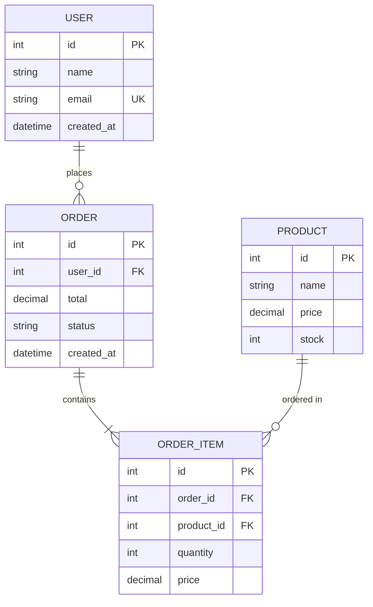

# 数据模型文档模板

> 记录项目的数据库设计和数据结构

---

## ER 图

---

## 表结构

### [表名1]

| 字段 | 类型 | 约束 | 说明 |
|------|------|------|------|
| id | INT | PK, AUTO_INCREMENT | 主键 |
| name | VARCHAR(255) | NOT NULL | 名称 |
| created_at | DATETIME | DEFAULT CURRENT_TIMESTAMP | 创建时间 |

**索引**：
- `idx_name` - name 字段索引

**关联**：
- 外键关联到 [其他表]

### [表名2]

...

---

## 枚举值

| 枚举 | 值 | 说明 |
|------|-----|------|
| 订单状态 | pending | 待支付 |
| 订单状态 | paid | 已支付 |
| 订单状态 | shipped | 已发货 |
| 订单状态 | completed | 已完成 |

---

## 数据迁移

| 版本 | 变更 | 日期 |
|------|------|------|
| v1.0 | 初始化表结构 | [日期] |
| v1.1 | 新增 xxx 字段 | [日期] |

---

## 相关文档

- [architecture.md](architecture.md) - 系统架构
