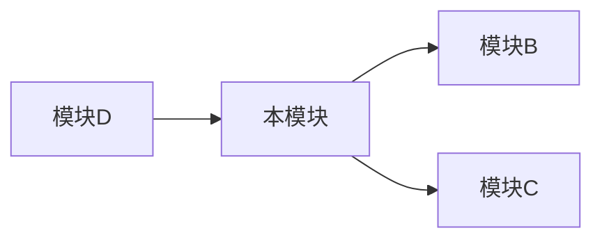

# [模块名称] 模块文档

> 模块职责：[一句话描述]

---

## 概述

[2-3 句话描述模块的功能和定位]

---

## 核心功能

| 功能 | 说明 | 入口 |
|------|------|------|
| [功能1] | [说明] | `functionName()` |
| [功能2] | [说明] | `functionName()` |

---

## 文件结构

```
modules/[模块名]/
├── index.ts          # 模块入口
├── service.ts        # 业务逻辑
├── controller.ts     # 控制器
├── types.ts          # 类型定义
├── utils.ts          # 工具函数
└── __tests__/        # 测试文件
```

---

## 核心代码

### [关键函数1]

```typescript
/**
 * [函数说明]
 */
async function keyFunction(param: Type): Promise<Result> {
  // 实现逻辑说明
}
```

**调用示例**：
```typescript
const result = await keyFunction(param);
```

---

## 依赖关系



| 依赖 | 说明 |
|------|------|
| 模块B | [依赖原因] |
| 模块C | [依赖原因] |

---

## 配置项

| 配置 | 类型 | 默认值 | 说明 |
|------|------|--------|------|
| `config.xxx` | string | `""` | [说明] |
| `config.yyy` | number | `10` | [说明] |

---

## 常见问题

### Q1: [问题描述]

**原因**：[原因说明]

**解决**：[解决方案]

---

## 变更记录

| 日期 | 变更 | 作者 |
|------|------|------|
| [日期] | [变更内容] | [作者] |

---

## 相关文档

- [architecture.md](../architecture.md) - 系统架构
- [其他模块.md](./other-module.md) - 相关模块
