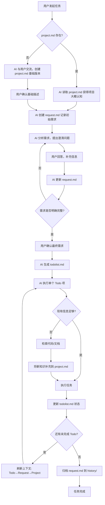
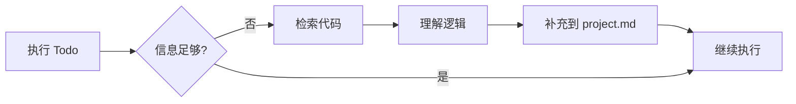

# AI 上下文记忆系统 (Context Memory System)

> **核心理念：** 像 Manus 一样工作 —— 使用持久化的 Markdown 文件作为 AI 的"磁盘上的工作记忆"，解决上下文窗口限制和目标漂移问题。

---

## 背景

在与 AI 交流复杂任务时，常见的问题包括：
- **易失性记忆** —— 上下文重置时，之前的进度和决策会丢失
- **目标漂移** —— 在多次工具调用后，原始目标容易被遗忘
- **信息过载** —— 所有内容挤在上下文中，降低性能并增加成本
- **工具碎片化** —— 不同编辑器/AI 工具的配置方式不同，难以统一

---

## 系统设计

### 核心文件结构（4 文件模式）

```
project_root/
├── .agentmem/                         # AI 系统专用目录
│   ├── project.md               # 项目整体描述（AI 快速了解项目的入口）
│   ├── request.md               # 当前需求文档（多轮交流澄清需求）
│   ├── todolist.md              # 任务待办列表（需求确定后生成）
│   ├── notes.md                 # 研究笔记与发现（可选）
│   ├── docs/                    # 详细文档目录（大型项目逐步积累）
│   │   ├── business-logic.md
│   │   ├── architecture.md
│   │   ├── modules/
│   │   └── ...
│   ├── request_detail/          # 需求对话详情（多轮交流后拆分）
│   │   └── dialog_round*.md
│   └── history/                 # 历史版本归档
│       └── [timestamp]_*.md
└── [项目文件...]
```

| 文件 | 定位 | 核心目的 | 生命周期 |
|------|------|----------|----------|
| `project.md` | 项目概览 | 让 AI 用最少上下文快速了解整个项目 | 长期维护 |
| `request.md` | 需求澄清 | 承载当前任务的多轮交流，逐步完善需求 | 任务周期 |
| `todolist.md` | 执行计划 | 需求确定后的任务分解与进度追踪 | 任务周期 |
| `notes.md` | 研究笔记 | 临时信息、中间发现、参考资料 | 按需使用 |

---

### 工作流程

#### 整体流程图



#### 关键设计点

| 设计点 | 说明 |
|--------|------|
| **渐进式理解** | 首次进入只需大概了解项目，不要求完整认知 |
| **按需检索** | 执行任务时发现信息不足，再去检索代码/文档 |
| **动态积累** | 检索到的知识实时补充到 `project.md`，形成知识沉淀 |
| **多轮澄清** | `request.md` 承载需求的多轮交流，确定后才生成 TodoList |
| **单步执行** | 每次只执行一个 Todo，及时更新状态 |

#### 简洁循环模式（Manus 风格）

```
循环 1: 创建 project.md（如不存在）+ request.md 记录需求
循环 2: 多轮澄清 → 用户确认 → 生成 todolist.md
循环 3: 执行 Todo → 更新状态 → 刷新上下文 → 下一个 Todo
循环 4: 全部完成 → 归档 → 交付最终输出
```

> 💡 **关键洞察**：每次循环开始前都要读取计划文件，确保目标保持在注意力窗口内。

#### 知识检索与补充流程



**补充规则：**
1. 只补充**通用性知识**（其他任务也可能用到的）
2. 任务特定的临时信息放 `notes.md`，不污染 `project.md`
3. 补充时遵循"索引优先"原则：简短摘要 + 详细文档链接

---

### 详细规范

#### 1. project.md — 项目整体描述

> **核心目标：** 让 AI 快速理解项目的三个维度：
> 1. **是什么** —— 项目定位、核心业务逻辑
> 2. **怎么做** —— 技术栈、架构设计、关键流程
> 3. **怎么改** —— 约定规范、注意事项

> **设计原则：**
> - **渐进式增长**：初始版本只需基础信息，随任务执行动态补充
> - **索引优先**：大型项目采用"主文档 + 详细文档"模式，按需加载
> - **知识沉淀**：每次任务中检索到的通用知识都应补充进来

**文件结构（随项目成长演进）：**

```
# 初始阶段（小型项目或项目初期）
.agentmem/
├── project.md              # 基础信息即可
├── request.md
└── todolist.md

# 成熟阶段（大型项目或经过多次任务后）
.agentmem/
├── project.md              # 主索引（保持精简 < 500 行）
├── docs/                   # 详细文档（任务中逐步积累）
│   ├── business-logic.md
│   ├── architecture.md
│   ├── modules/
│   │   ├── auth.md
│   │   └── ...
│   ├── data-models.md
│   └── conventions.md
├── request.md
├── todolist.md
└── history/
```

---

**初始版本模板**（首次创建时使用）：

```markdown
# [项目名称]

## 一句话描述
[这个项目是什么、为谁解决什么问题]

## 技术栈
- 语言: [如 TypeScript]
- 框架: [如 Next.js]
- 数据库: [如 PostgreSQL]

## 目录结构
```
[简单列出主要目录]
```

## 已知信息
[目前了解到的任何有用信息]

---
*此文档将随任务执行逐步完善*
```

---

**成熟版本模板**（经过多次任务积累后）：

```markdown
# [项目名称]

## 一句话描述
[用一句话说清楚这个项目是什么、为谁解决什么问题]

---

## 核心业务逻辑

[2-3 句话描述核心业务]

### 关键模块速览
| 模块 | 一句话职责 | 详细文档 |
|------|------------|----------|
| 用户认证 | 注册/登录/权限控制 | → [auth.md](docs/modules/auth.md) |
| 支付系统 | 订单支付与退款处理 | → [payment.md](docs/modules/payment.md) |
| ... | ... | ... |

> 📖 **完整业务逻辑**：[docs/business-logic.md](docs/business-logic.md)

---

## 技术栈
- 语言: [如 TypeScript, Python]
- 框架: [如 Next.js, FastAPI]
- 数据库: [如 PostgreSQL, MongoDB]
- 其他: [如 Docker, Redis]

> 📖 **架构详解**：[docs/architecture.md](docs/architecture.md)

---

## 目录结构
```
src/
├── api/          # API 路由
├── components/   # UI 组件
├── services/     # 业务逻辑
└── utils/        # 工具函数
```

---

## 核心概念/术语
| 术语 | 含义 |
|------|------|
| [术语1] | [解释] |
| [术语2] | [解释] |

---

## 约定与规范（速览）
- 代码风格: ESLint + Prettier
- 命名规范: camelCase
- Git 分支: main/develop/feature-*

> 📖 **完整规范**：[docs/conventions.md](docs/conventions.md)

---

## 当前状态
- **版本**: v1.2.0
- **阶段**: 开发中
- **最近变更**: [简述]

---

## ⚠️ 必读注意事项
- [最关键的坑点1]
- [最关键的坑点2]

---

## 📚 详细文档索引

| 文档 | 内容 | 何时阅读 |
|------|------|----------|
| [business-logic.md](docs/business-logic.md) | 完整业务流程 | 理解业务需求时 |
| [architecture.md](docs/architecture.md) | 系统架构设计 | 做架构级改动时 |
| [data-models.md](docs/data-models.md) | 数据库模型 | 涉及数据层改动时 |
| [conventions.md](docs/conventions.md) | 完整编码规范 | 新增代码时参考 |
| [modules/*.md](docs/modules/) | 各模块详解 | 修改特定模块时 |
```

> **使用说明：**
> - AI 首次进入项目时只读 `project.md`（快速建立全局认知）
> - 执行具体任务时，根据需要读取相应的详细文档
> - 详细文档采用"按需加载"，避免上下文膨胀

#### 2. request.md — 需求澄清文档

> **核心目标：** 承载用户需求的多轮交流，逐步从模糊到清晰。

```markdown
# 需求：[简短标题]

## 用户原始描述
> [用户最初的需求表述，原样记录]

## 澄清对话

### 第 1 轮
**AI 问题：**
1. [需要澄清的问题1]
2. [需要澄清的问题2]

**用户回答：**
1. [用户的回答1]
2. [用户的回答2]

### 第 2 轮
**AI 问题：**
...

**用户回答：**
...

## 需求理解（AI 总结）
经过以上交流，需求确认如下：

### 目标
[明确的目标描述]

### 范围
- ✅ 包含: [要做的事情]
- ❌ 不包含: [明确不做的事情]

### 约束
- [技术约束]
- [时间约束]
- [其他约束]

### 验收标准
1. [完成标准1]
2. [完成标准2]

## 状态
- [ ] 需求澄清中
- [ ] 用户已确认，待生成 TodoList
- [ ] 已转为 TodoList，执行中
```

#### 3. todolist.md — 执行计划

> **前置条件：** 仅在 `request.md` 中的需求被用户确认后才创建此文件。

```markdown
# 任务列表：[需求标题]

## 关联需求
来源: `.agentmem/request.md`
需求摘要: [从 request.md 复制的需求目标]

## 待办事项
- [ ] **TODO-001**: [任务描述]
  - 预计: [预估工作量/时间]
  - 依赖: [依赖的文件或任务]
- [/] **TODO-002**: [正在进行的任务] ← 当前
- [x] **TODO-003**: [已完成的任务]
  - 完成: [实际完成情况简述]

## 执行日志
### TODO-003 执行记录
- **开始**: [时间]
- **操作**: [具体做了什么]
- **结果**: [结果摘要]
- **完成**: [时间]

## 遇到的问题
- [问题描述] → [解决方案]
```

#### 4. notes.md — 研究笔记（可选）

```markdown
# 研究笔记

## [主题 1]
### 来源
- [文件/URL]: [关键发现]

### 结论
- [总结性发现]

## [主题 2]
...
```

#### 5. deliverable.md — 交付物（可选）

> **核心目标：** 作为任务的最终输出文件，记录完成的工作成果。

```markdown
# [交付物标题]

## 概述
[一句话描述本次交付的内容]

## 已完成的改动

### 1. [改动类别 1]
- **文件**: `path/to/file`
- **内容**: [具体改动描述]

### 2. [改动类别 2]
...

## 验证结果
- [x] [测试项 1] - 通过
- [x] [测试项 2] - 通过

## 后续建议（可选）
- [可能的优化点]
- [未来可扩展的方向]
```

---

### 关键规则

#### 规则 1: 先有文档，再有行动
在执行任何复杂任务前，必须先创建/读取 `project.md`。初始版本可以很简单，随任务逐步完善。

#### 规则 2: 刷新上下文，按需补充
在做出重大决策或开始新 Todo 前，**必须刷新上下文**（这是防止目标漂移的关键）：

```
→ 每次重大决策前：Read todolist.md → Read request.md → Read project.md
```

1. **读取当前 Todo**（`todolist.md`）：明确当前要做什么
2. **读取需求目标**（`request.md`）：确保理解用户的真实意图
3. **读取项目背景**（`project.md`）：补充必要的项目认知
4. 如发现信息不足，检索代码/文档
5. 补充新知识（遵循"索引优先"原则）

> 💡 **优先级说明**：Todo 和 Request 决定"做什么"，Project 提供"怎么做"的背景
> 
> ⚠️ **关键洞察**：通过在每次决策前刷新计划，目标始终保持在注意力窗口内。这是 Manus 能处理约 50 次工具调用而不丢失进度的秘诀。

**补充策略（防止 project.md 膨胀）：**
| 内容类型 | 存放位置 | 示例 |
|----------|----------|------|
| 一句话摘要 | `project.md` | "支付模块负责订单支付与退款" |
| 详细说明 | `docs/xxx.md` | 具体的支付流程、接口文档 |
| 代码片段 | `docs/modules/xxx.md` | 关键函数实现 |

```
# project.md 中只写索引：
## 支付模块
负责订单支付与退款处理 → [详细](docs/modules/payment.md)

# docs/modules/payment.md 中写详细内容
```

> ⚠️ **拆分阈值**：当 `project.md` 超过 300 行时，应将详细内容迁移到 `docs/`

#### 规则 3: 需求先澄清，确认再执行
用户的初始需求往往不完整，必须通过 `request.md` 进行多轮交流：
1. 创建 `request.md`，记录用户原始描述
2. AI 分析需求，提出澄清问题
3. 用户回答后更新文档
4. 循环直到需求明确
5. **用户确认后**才生成 `todolist.md`

**防止 request.md 膨胀策略（索引 + 详细文档模式）：**

类似 `project.md`，`request.md` 也采用索引模式，详细对话拆分到子文档：

```
.agentmem/
├── request.md                    # 主文档：需求摘要 + 索引
├── request_detail/               # 详细文档目录
│   ├── dialog_round1-5.md        # 第 1-5 轮对话原文
│   ├── dialog_round6-10.md       # 第 6-10 轮对话原文
│   └── ...
```

| 存放位置 | 内容 |
|----------|------|
| `request.md` | 需求摘要、结论、验收标准（必读） |
| `request_detail/*.md` | 完整对话记录（按需查阅） |

```markdown
# request.md（主文档，保持精简）

## 需求摘要
支付模块需支持微信支付和支付宝，退款走原路返回。

## 澄清要点
- 不需要分账功能 → [对话详情](request_detail/dialog_round1-5.md#分账讨论)
- 退款时效要求 3 天 → [对话详情](request_detail/dialog_round3-5.md#退款讨论)

## 需求理解（完整保留）
...

## 验收标准
1. ...
```

> ⚠️ **拆分阈值**：当对话超过 5 轮或文档超过 150 行，将对话原文拆分到 `request_detail/`
> ⚠️ 禁止跳过澄清阶段直接开始执行

**需求确认后自检：**
用户确认需求后，AI 必须进行自检：
1. 检查需求描述是否有遗漏或矛盾
2. 检查技术可行性是否有风险
3. 检查验收标准是否明确可验证
4. 如发现缺陷 → 提醒用户，继续对话完善
5. 自检通过 → 生成 `todolist.md`

```markdown
## 自检结果
- [x] 需求描述完整无矛盾
- [x] 技术方案可行
- [ ] 验收标准不够明确 ← 需补充

### 需补充的问题
1. "性能要符合要求" 具体指什么指标？
```

#### 规则 4: 单步执行，及时更新
每次只执行一个 Todo 项，完成后立即更新 `todolist.md`：
- 标记当前项为 `[x]`
- 记录执行结果到"执行日志"
- 将下一项标记为 `[/]`

#### 规则 5: 存储而非填充
长篇内容存入文件，上下文中只保留路径引用。

#### 规则 6: 知识沉淀
- 通用性知识 → 补充到 `project.md` 或 `docs/`
- 任务特定信息 → 记录到 `notes.md`
- 遇到的问题 → 记录到相应文档，为后续任务积累经验

#### 规则 7: 上下文优化（来自 Manus 原则）

| 原则 | 说明 | 实践 |
|------|------|------|
| **仅追加上下文** | 永不修改之前的消息，避免 KV 缓存失效 | 新信息始终追加，不回头修改历史 |
| **稳定前缀** | 将静态内容放最前面，提高缓存命中率 | 系统指令 → 项目背景 → 动态内容 |
| **避免 Few-Shot 过拟合** | 不要盲目复制重复的操作模式 | 稍微改变措辞，对重复任务重新校准 |
| **可逆压缩** | 压缩的信息必须能还原 | 存储路径而非删除，需要时可"查找" |

#### 规则 8: 任务完成后清理
任务全部完成后，执行清理：

| 操作 | 文件 | 说明 |
|------|------|------|
| 归档 | `request.md` → `history/[日期]_request_xxx.md` | 保留完整记录 |
| 归档 | `request_detail/*` → `history/[日期]_request_detail/` | 对话详情一并归档 |
| 归档 | `todolist.md` → `history/[日期]_todolist_xxx.md` | 保留执行记录 |
| 删除 | `notes.md` | 任务特定信息不再需要 |
| 保留 | `project.md` 和 `docs/` | 长期知识库保留 |

```bash
# 归档示例
mv .agentmem/request.md .agentmem/history/20260108_request_支付模块集成.md
mv .agentmem/request_detail/ .agentmem/history/20260108_request_detail/
mv .agentmem/todolist.md .agentmem/history/20260108_todolist_支付模块集成.md
rm .agentmem/notes.md  # 或归档（如需保留）
```

---

### 反模式对照表

| ❌ 不要这样做 | ✅ 而是这样做 |
|---------------|---------------|
| 使用 AI 内置记忆进行持久化 | 创建 `.agentmem/` 目录下的 Markdown 文件 |
| 只说一次目标然后就忘了 | 在每次重大决策前重新阅读 todolist.md |
| 隐藏错误并静默重试 | 将错误记录到"遇到的问题"部分 |
| 将所有内容塞进上下文 | 长篇内容存入文件，上下文只保留路径 |
| 不澄清需求直接开始执行 | 通过 request.md 多轮交流确认需求 |
| 一次性做大规模修改 | 单步执行 Todo，及时更新状态 |
| 修改之前的历史消息 | 始终追加新信息，保持上下文稳定 |

---

### 错误恢复模式示例

**❌ 错误做法：**
```
行动: Read config.json
错误: File not found
行动: Read config.json  # 静默重试
行动: Read config.json  # 再次重试...
```

**✅ 正确做法：**
```
行动: Read config.json
错误: File not found

# 更新 todolist.md:
## 遇到的问题
- 未找到 config.json → 将创建默认配置

行动: Write config.json (创建默认配置)
行动: Read config.json
成功！
```

> 💡 错误恢复是真正 agentic 行为最清晰的信号之一。记录失败后，模型会更新其内部理解。

---

## 跨工具适配方案

### 适配矩阵

| 工具 | 机制 | 配置位置 | 说明 |
|------|------|----------|------|
| **Claude Code** | Skills | `~/.claude/skills/` 或 `.claude/skills/` | 使用 SKILL.md 定义行为 |
| **Trae** | Rules | `.trae/rules/` | 使用 YAML + Markdown 规则 |
| **Antigravity (Gemini)** | Rules | `~/.gemini/` 或项目内 `rules.md` | 全局/项目级规则 |
| **Windsurf** | Rules | `.windsurfrules` 或 `.cursorrules` | 类 Cursor 规则文件 |
| **Cursor** | Rules | `.cursorrules` | Markdown 规则文件 |
| **OpenCode** | Custom | 项目内配置 | 根据具体实现 |
| **VS Code Copilot** | Instructions | `.github/copilot-instructions.md` | 项目级说明 |
| **Cline/Roo** | Memory | `.clinerules` / `.roo/` | 规则文件或 Memory Bank |

---

### 各工具配置模板

#### Claude Code (.claude/skills/context-memory/SKILL.md)

```markdown
---
name: context-memory-system
description: 使用持久化 Markdown 文件管理 AI 工作记忆。在开始复杂任务、多步骤项目时自动激活。
---

# 上下文记忆系统

## 快速开始
1. 复杂任务开始前，检查 `.agentmem/project.md` 是否存在
2. 若存在，读取恢复上下文；若不存在，创建基础版本
3. 创建 `request.md` 开始需求澄清（多轮交流）
4. 用户确认需求后生成 `todolist.md`
5. 单步执行 Todo，按需检索代码并补充知识

## 核心规则
- 刷新上下文优先级：Todo → Request → Project
- 需求必须澄清确认后才开始执行
- 每次只做一个 Todo，立即更新状态
- 检索到的通用知识补充到 `project.md`
```

#### Cursor / Windsurf / Trae (.cursorrules 或等效文件)

```markdown
# 上下文记忆系统规则

## 触发条件
当用户请求涉及多步骤或复杂修改时，自动启用上下文记忆工作流。

## 工作流
1. 检查 `.agentmem/project.md`，存在则读取，不存在则创建基础版本
2. 创建 `request.md`，与用户多轮交流澄清需求
3. 用户确认需求后生成 `todolist.md`
4. 单步执行 Todo，刷新上下文（Todo → Request → Project）
5. 信息不足时检索代码，通用知识补充到 `project.md`

## 文件位置
- `.agentmem/project.md` - 项目整体描述（长期维护）
- `.agentmem/request.md` - 当前需求澄清（任务周期）
- `.agentmem/todolist.md` - 任务分解与进度（任务周期）
- `.agentmem/notes.md` - 研究笔记（可选）

## 禁止行为
- 不跳过需求澄清直接执行
- 不做一次性大规模修改
- 不忽略错误直接重试
```

#### VS Code Copilot (.github/copilot-instructions.md)

```markdown
# 项目 AI 协作指南

本项目使用 `.agentmem/` 目录管理 AI 工作记忆：
- `project.md`: 项目整体描述（快速了解项目）
- `request.md`: 当前需求澄清（多轮交流确认）
- `todolist.md`: 任务分解与进度

执行复杂任务前，请依次阅读这些文件了解上下文。
```

---

## MCP Server 方案（可选增强）

对于支持 MCP 的工具，可以提供一个轻量级 MCP Server 来标准化操作：

### 工具定义

| 工具名 | 作用 |
|--------|------|
| `context_init` | 初始化 `.agentmem/` 目录和 `project.md` |
| `context_read` | 读取当前项目上下文 |
| `todo_add` | 添加 Todo 项 |
| `todo_complete` | 标记 Todo 完成并记录结果 |
| `context_refresh` | 刷新目标（在上下文末尾追加 project.md 摘要）|

### 资源定义

| 资源 URI | 内容 |
|----------|------|
| `context://project` | 当前 project.md 内容 |
| `context://todo` | 当前 todolist.md 内容 |
| `context://summary` | 项目摘要（压缩版） |

---

## 使用场景判断

### 启动前快速判断

收到用户请求后，按以下清单快速评估是否启用此系统：

**触发信号（满足任一则启用）：**
- [ ] 涉及 **3 个以上文件** 的修改
- [ ] 需要 **多轮交流** 才能理解用户意图
- [ ] 预计需要 **10 次以上工具调用**
- [ ] 涉及 **新功能开发** 或 **架构调整**
- [ ] 用户明确提到"规划"、"分步"、"追踪进度"等关键词

**跳过信号（满足则跳过）：**
- [ ] 单文件小改 / 简单问答 / 快速查询
- [ ] 可在 **3 次工具调用内** 完成

> 💡 **原则**：宁可多用不可少用。如拿不准，先创建 `project.md`，发现没必要再删除，成本极低。

### 场景参考表
| 场景 | 是否使用此系统 | 原因 |
|------|----------------|------|
| 多文件重构 | ✅ 是 | 需要追踪多个改动点 |
| 新功能开发 | ✅ 是 | 需要设计和分步实现 |
| Bug 调试 | ✅ 是 | 需要记录排查过程 |
| 研究调研 | ✅ 是 | 需要存储发现结果 |
| 单文件小改 | ❌ 否 | 过度工程 |
| 简单问答 | ❌ 否 | 不需要持久化 |
| 快速原型 | ⚠️ 视情况 | 若多轮迭代则使用 |

---

## Manus 关键数据统计

> 以下数据来自 Manus AI（2025 年被 Meta 以 20 亿美元收购）的公开分享。

| 指标 | 数值 | 说明 |
|------|------|------|
| 每次任务平均工具调用 | ~50 次 | 需要持久化机制防止目标漂移 |
| 输入输出 Token 比 | 100:1 | Agent 是输入密集型，每个 Token 都有成本 |
| 上下文刷新频率 | 每次决策前 | 在注意力窗口末尾读取计划文件 |
| 收购价格 | 20 亿美元 | 证明上下文工程的商业价值 |
| 实现 1 亿营收时间 | 8 个月 | 从发布到盈利的速度 |

---

## 参考资料

- [Manus 上下文工程原则](https://manus.im/de/blog/Context-Engineering-for-AI-Agents-Lessons-from-Building-Manus)
- [Claude Code Skills 官方文档](https://docs.anthropic.com/en/docs/agents-and-tools/claude-code/skills)
- [planning-with-files](./planning-with-files/) - OthmanAdi 的 Claude Code Skill 实现

---

## 待完善事项

- [ ] 各工具的完整配置文件示例
- [ ] MCP Server 的具体实现代码
- [ ] 自动化初始化脚本
- [ ] 与 Git 工作流的集成方案
- [ ] 多人协作场景的处理