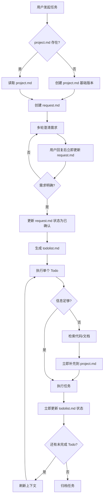

# 上下文记忆系统规则

> 使用持久化 Markdown 文件管理 AI 工作记忆,解决上下文窗口限制和目标漂移问题。

> 📖 **详细示例**: 需要更多说明和示例?请查看 [common-rules-examples.md](.claude/skills/context-memory-system/docs/common-rules-examples.md)

---

## 核心文件

| 文件 | 定位 | 生命周期 |
|------|------|----------|
| `.agentmem/project.md` | 项目整体描述 | 长期维护 |
| `.agentmem/request.md` | 当前需求澄清 | 任务周期 |
| `.agentmem/todolist.md` | 任务分解与进度 | 任务周期 |
| `.agentmem/notes.md` | 研究笔记 | 按需使用 |
| `.agentmem/docs/` | 详细文档目录 | 长期积累 |
| `.agentmem/request_detail/` | 需求对话详情 | 任务周期 |
| `.agentmem/history/` | 历史归档 | 永久保留 |

---

## 触发判断

**启用信号（满足任一）:**
- 涉及 3+ 文件修改
- 需多轮交流理解意图
- 预计 10+ 次工具调用
- 新功能开发或架构调整
- 用户提到「规划」「分步」「追踪进度」

**跳过信号:**
- 单文件小改/简单问答/快速查询
- 3 次工具调用内可完成

> 💡 **原则**: 宁可多用不可少用。拿不准就先创建 project.md,成本极低。

---

## 🚨 任务进行中禁止退出

**触发条件（满足任一）:**
- ✅ 已创建 `request.md` 或 `todolist.md`

**核心规则:**
1. 用户的所有回复都是任务的一部分,不要重新判断是否启用
2. 用户要求"先测试""检查一下"等,应在 todolist.md 中记录,而非退出流程
3. 只有用户明确说"停止""取消""不做了",才能归档任务并退出

**场景示例:**
- 用户说"先测试" → 在 todolist.md 中记录 → 执行测试 → 更新状态 → 询问是否继续
- 用户提出明显不相关需求 → 先确认:"这是当前任务的一部分,还是新的独立任务?"

**任务完成标志:**
- todolist.md 中所有 Todo 项标记为 `[x]`
- 或用户明确表示"任务完成""可以了"

**特殊情况:** 用户提出明显不相关需求时,必须先确认是当前任务的一部分还是新任务,只有明确表示是新任务才能归档当前任务。

---

## 整体流程



---

## 📢 动作输出规范

**目的:** 让用户知道 FlowMem 流程是否启用及当前执行步骤。

### 必须输出的关键动作

执行以下动作时必须输出提示:

| 动作 | 格式 |
|------|------|
| **流程启动** | 🚀 **FlowMem 已启动** - 触发原因: [信号] |
| **文件操作** | 📝 **[创建/读取/更新/归档]**: `.agentmem/[文件名]` |
| **上下文刷新** | 🔄 **刷新上下文** - 当前 Todo: [任务] |
| **需求澄清** | ❓ **需求澄清** (第 X 轮) - 待确认: [问题] |
| **知识补充** | 💡 **知识沉淀** - 补充到: [文件] |
| **任务归档** | ✅ **任务完成** - 已归档: [文件列表] |

### 示例

```
🚀 **FlowMem 已启动** - 触发原因: 涉及 5+ 文件修改
📝 **创建**: `.agentmem/project.md`
📝 **创建**: `.agentmem/request.md`
❓ **需求澄清** (第 1 轮) - 待确认: 是否需要向后兼容?
```

**规则:** 每个关键动作必须输出,不允许静默执行

---

## 8 条关键规则

### 规则 1: 先有文档,再有行动
执行复杂任务前必须先创建/读取 `project.md`。初始版本可以很简单,随任务逐步完善。

### 规则 2: 刷新上下文,按需补充

**刷新顺序:** `todolist.md` → `request.md` → `project.md`

**5 步流程:**
1. 读取当前 Todo - 明确当前要做什么
2. 读取需求目标 - 确保理解用户真实意图
3. 读取项目背景 - 补充必要的项目认知
4. 如信息不足,检索代码/文档
5. 立即补充新知识到文档

> 💡 **优先级说明**: Todo 和 Request 决定"做什么",Project 提供"怎么做"的背景

**拆分阈值:**
- `project.md` 超过 300 行 → 迁移到 `docs/`
- 单模块说明超过 50 行 → 拆分到独立文档
- `request.md` 对话超过 5 轮或 150 行 → 拆分到 `request_detail/`

**索引优先原则:**
```markdown
# project.md 中只写索引
## 支付模块
负责订单支付与退款 → [详细](docs/modules/payment.md)
```

**project.md 设计目标:** 让 AI 快速理解项目的 **是什么**、**怎么做**、**怎么改**

### 规则 3: 需求先澄清,确认再执行

**流程:**
1. 创建 `request.md`,记录原始需求
2. AI 提出澄清问题
3. **用户回答后立即更新 `request.md`**
4. 循环直到需求明确
5. **用户确认后先更新状态为「已确认」,再生成 `todolist.md`**

⚠️ 禁止用户回复后直接开始执行,必须先更新文档。

**需求确认后自检:**
```markdown
## 自检结果
- [x] 需求描述完整无矛盾
- [x] 技术方案可行
- [ ] 验收标准不够明确 ← 需补充
```

### 规则 4: 🚨 单步执行,及时更新

**强制时序:** 执行 Todo → 立即更新 todolist.md → 执行下一个 Todo

**禁止:**
- ❌ 连续执行多个 Todo 后才统一更新
- ❌ 心里记住"待会儿更新"

**正确:**
```
✅ 执行 Todo 1 → 更新 → 执行 Todo 2 → 更新
❌ 执行 Todo 1 → 执行 Todo 2 → 执行 Todo 3 → 更新
```

### 规则 5: 存储而非填充
长篇内容存入文件,上下文中只保留路径引用。

### 规则 6: 🚨 知识沉淀

**强制时序:** 检索 → 立即补充文档 → 继续执行

**补充规则:**
- 通用性知识 → `project.md` 或 `docs/`
- 任务特定信息 → `notes.md`
- 遵循「索引优先」原则,防止文档膨胀

**禁止:** 检索后延后补充 ❌

### 规则 7: 上下文优化（Manus 4 原则）

| 原则 | 实践 |
|------|------|
| 仅追加上下文 | 新信息始终追加,不修改历史 |
| 稳定前缀 | 系统指令 → 项目背景 → 动态内容 |
| 避免过拟合 | 稍微改变措辞,重新校准 |
| 可逆压缩 | 存储路径而非删除 |

### 规则 8: 任务完成后清理

```bash
# 归档示例
mv .agentmem/request.md .agentmem/history/20260108_request_xxx.md
mv .agentmem/request_detail/ .agentmem/history/20260108_request_detail/
mv .agentmem/todolist.md .agentmem/history/20260108_todolist_xxx.md
rm .agentmem/notes.md
# project.md 和 docs/ 保留
```

---

## ✅ AI 自检清单

**文档更新:**
- [ ] 用户回复澄清问题 → 已更新 `request.md`?
- [ ] 用户确认需求 → 已更新状态为「已确认」?
- [ ] 完成 Todo → 已更新 `todolist.md` 标记 `[x]`?
- [ ] 检索到知识 → 已立即补充到文档?

**任务状态:**
- [ ] 是否在任务进行中?
- [ ] 用户回复是否被理解为任务的一部分?
- [ ] 是否有退出冲动?是否符合退出条件?

**执行规范:**
- [ ] 是否遵循"单步执行"原则?
- [ ] 是否遵循"立即更新"原则?
- [ ] 是否遵循"立即补充"原则?

---

## 循环模式

### 开发模式
```
1. 创建 project.md + request.md
2. 多轮澄清 → 确认 → 更新状态 → 生成 todolist.md
3. 执行 Todo → 更新状态 → 刷新上下文 → 下一个 Todo
4. 完成 → 归档 → 交付
```

### 研究模式
```
1. 创建 todolist.md (列出关键问题)
2. 搜索/阅读 → 立即记录 notes.md
3. 合成发现 → 更新 todolist.md
4. 交付结论
```

---

## 反模式对照

| ❌ 不要 | ✅ 而是 |
|---------|---------|
| 使用 AI 内置记忆 | 创建 `.agentmem/` 文件 |
| 只说一次目标 | 每次决策前重读 todolist.md |
| 静默重试错误 | 记录到"遇到的问题" |
| 内容塞进上下文 | 存文件,引用路径 |
| 不澄清直接执行 | 通过 request.md 多轮确认 |
| 检索后延后补充 | 检索后立即补充 |
| 连续执行多个 Todo | 单步执行,及时更新 |

---

## 错误恢复模式

**❌ 错误**: 静默重试
**✅ 正确**: 记录问题 → 更新 todolist.md → 采取解决方案

```markdown
# 示例: 文件未找到
错误: File not found

## 遇到的问题 (记录到 todolist.md)
- 未找到 config.json → 将创建默认配置

行动: Write config.json (创建默认配置)
```

---

## 场景参考

| 场景 | 使用 | 原因 |
|------|------|------|
| 多文件重构 | ✅ | 需追踪多个改动点 |
| 新功能开发 | ✅ | 需设计和分步实现 |
| Bug 调试 | ✅ | 需记录排查过程 |
| 研究调研 | ✅ | 需存储发现结果 |
| 单文件小改 | ❌ | 过度工程 |
| 简单问答 | ❌ | 不需要持久化 |

---

## 参考资源

### 结构模板
- `.claude/skills/context-memory-system/templates/project-mature.md` - project.md 模板
- `.claude/skills/context-memory-system/templates/request.md` - 包含澄清对话和自检
- `.claude/skills/context-memory-system/templates/todolist.md` - 包含执行日志和问题记录

### Few-Shot 示例
- `.claude/skills/context-memory-system/examples/01-new-feature/` - 新功能开发
- `.claude/skills/context-memory-system/examples/02-refactor/` - 重构
- `.claude/skills/context-memory-system/examples/03-debug/` - 调试

### 辅助工具
- `.claude/skills/context-memory-system/scripts/refresh-context.sh` - 上下文刷新
- `.claude/skills/context-memory-system/scripts/archive-task.sh` - 任务归档

### 最佳实践指南
建议在以下情况阅读 `.claude/skills/context-memory-system/docs/best-practices.md`:
- 接手新项目(冷启动流程)
- 不确定如何拆分文档
- 陷入循环或死胡同
- 了解高级技巧(如错误恢复模式)
