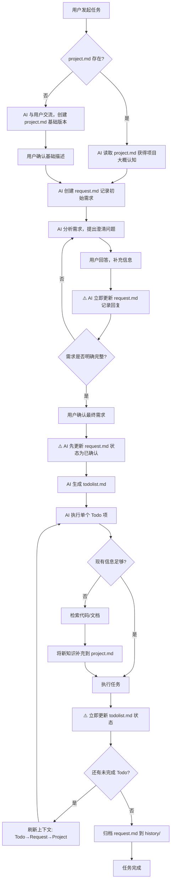
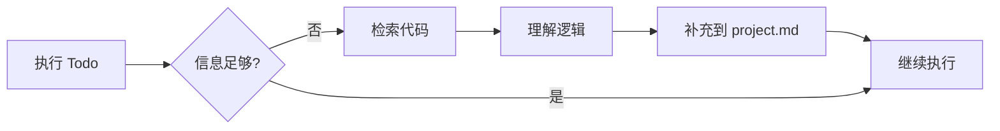

# 上下文记忆系统规则

> 使用持久化 Markdown 文件管理 AI 工作记忆。

> **核心理念**：使用持久化的 Markdown 文件作为 AI 的"磁盘上的工作记忆"，解决上下文窗口限制和目标漂移问题。

---

## 背景问题

在与 AI 交流复杂任务时，常见的问题包括：
- **易失性记忆** — 上下文重置时，之前的进度和决策会丢失
- **目标漂移** — 在多次工具调用后，原始目标容易被遗忘
- **信息过载** — 所有内容挤在上下文中，降低性能并增加成本
- **工具碎片化** — 不同编辑器/AI 工具的配置方式不同，难以统一

---

## 触发判断

**触发信号（满足任一则启用）：**
- 涉及 3 个以上文件的修改
- 需要多轮交流才能理解用户意图
- 预计需要 10 次以上工具调用
- 涉及新功能开发或架构调整
- 用户提到「规划」「分步」「追踪进度」等关键词

**跳过信号：**
- 单文件小改 / 简单问答 / 快速查询
- 可在 3 次工具调用内完成

> 💡 **原则**：宁可多用不可少用。拿不准就先创建 project.md，成本极低。

---

## 核心文件

| 文件 | 定位 | 生命周期 |
|------|------|----------|
| `.agentmem/project.md` | 项目整体描述 | 长期维护 |
| `.agentmem/request.md` | 当前需求澄清 | 任务周期 |
| `.agentmem/todolist.md` | 任务分解与进度 | 任务周期 |
| `.agentmem/notes.md` | 研究笔记 | 按需使用 |
| `.agentmem/docs/` | 详细文档目录 | 长期积累 |
| `.agentmem/request_detail/` | 需求对话详情 | 任务周期 |
| `.agentmem/history/` | 历史归档 | 永久保留 |

---

## 关键设计点

| 设计点 | 说明 |
|--------|------|
| **渐进式理解** | 首次进入只需大概了解项目，不要求完整认知 |
| **按需检索** | 执行任务时发现信息不足，再去检索代码/文档 |
| **动态积累** | 检索到的知识**立即补充**到 `project.md`，形成知识沉淀 |
| **多轮澄清** | `request.md` 承载需求的多轮交流，**每次用户回复后立即更新文档** |
| **单步执行** | 每次只执行一个 Todo，**完成后立即更新 todolist.md 状态** |

## 简洁循环模式（Manus 风格）

**模式选择标准：**
- **开发模式**：目标是产出代码、修改文件或实现功能。
- **研究模式**：目标是回答问题、调研方案或排查未知根因（Bug 修复的前半段）。

### 开发模式 (Development Loop)
```
循环 1: 创建 project.md（如不存在）+ request.md 记录需求
循环 2: 多轮澄清(每次用户回复后更新 request.md) → 用户确认 → 更新 request.md 状态 → 生成 todolist.md
循环 3: 执行 Todo → 更新 todolist.md 状态 → 刷新上下文 → 下一个 Todo
循环 4: 全部完成 → 归档 → 交付最终输出
```

### 研究模式 (Research Loop)
```
循环 1: 创建 todolist.md (列出"关键问题")
循环 2: 搜索/阅读 → 立即记录 notes.md (或在 todolist 中记录发现)
循环 3: 合成发现 → 立即更新 todolist.md (回答问题/已做决策)
循环 4: 交付结论 (deliverable.md)
```

> 💡 **关键洞察**：每次循环开始前都要读取计划文件，确保目标保持在注意力窗口内。

## 整体流程图



## 知识检索与补充流程



---

## 8 条关键规则

### 规则 1: 先有文档，再有行动
在执行任何复杂任务前，必须先创建/读取 `project.md`。初始版本可以很简单，随任务逐步完善。

### 规则 2: 刷新上下文，按需补充
每次重大决策前 **必须刷新上下文**（防止目标漂移的关键）：

```
刷新顺序：todolist.md → request.md → project.md
```

**5 步详细说明：**
1. **读取当前 Todo**（`todolist.md`）：明确当前要做什么
2. **读取需求目标**（`request.md`）：确保理解用户的真实意图
3. **读取项目背景**（`project.md`）：补充必要的项目认知
4. 如发现信息不足，检索代码/文档
5. 补充新知识（遵循"索引优先"原则）

> 💡 **优先级说明**：Todo 和 Request 决定"做什么"，Project 提供"怎么做"的背景

**拆分阈值**：当 `project.md` 超过 **300 行** 时，将详细内容迁移到 `docs/`

**索引优先原则**：
```markdown
# project.md 中只写索引
## 支付模块
负责订单支付与退款处理 → [详细](docs/modules/payment.md)

# request.md 中只写摘要
## 澄清要点
- 不需要分账功能 → [对话详情](request_detail/dialog_round1-5.md#分账讨论)
- 退款时效要求 3 天 → [对话详情](request_detail/dialog_round3-5.md#退款讨论)
```

### project.md 设计原则

> **核心目标**：让 AI 快速理解项目的三个维度：
> 1. **是什么** — 项目定位、核心业务逻辑
> 2. **怎么做** — 技术栈、架构设计、关键流程
> 3. **怎么改** — 约定规范、注意事项

- **渐进式增长**：初始版本只需基础信息，随任务执行动态补充
- **索引优先**：大型项目采用"主文档 + 详细文档"模式，按需加载
- **知识沉淀**：每次任务中检索到的通用知识都应补充进来

### 规则 3: 需求先澄清,确认再执行
1. 创建 `request.md`,记录用户原始描述
2. AI 分析需求,提出澄清问题
3. **用户回答后必须立即更新 `request.md`**,记录用户的回复内容
4. 循环直到需求明确
5. **用户确认后必须先更新 `request.md` 状态为「已确认」**,然后才生成 `todolist.md`

**⚠️ 关键约束**:
- 每次用户回复后,**禁止直接开始执行任务**
- 必须先将用户的回复内容更新到 `request.md` 对应的澄清对话记录中
- 用户最终确认后,必须先更新 `request.md` 顶部状态标记(如 `> **状态**:✅ 已确认`)
- 只有完成上述更新后,才能生成 `todolist.md`

**拆分阈值**:对话超过 **5 轮** 或文档超过 **150 行**,将对话原文拆分到 `request_detail/`

**需求确认后自检**:
```markdown
## 自检结果
- [x] 需求描述完整无矛盾
- [x] 技术方案可行
- [ ] 验收标准不够明确 ← 需补充
```

### 规则 4: 单步执行,及时更新
**⚠️ 强制约束**: 每次只执行一个 Todo 项,**禁止连续执行多个 Todo**。

**执行流程**:
1. 执行当前 Todo 项
2. **完成后必须立即更新 `todolist.md`**:
   - 标记当前项为 `[x]`
   - 记录执行结果到「执行日志」部分
   - 将下一项标记为 `[/]`(进行中)
3. **更新完成后才能继续下一个 Todo**

**禁止行为**:
- ❌ 完成 Todo A 后直接开始 Todo B,不更新 todolist.md
- ❌ 一次性执行多个 Todo 项后才统一更新状态
- ❌ 在心里记住"待会儿更新",先继续执行下一个任务

**正确示例**:
```
✅ 执行 Todo 1 → 更新 todolist.md → 执行 Todo 2 → 更新 todolist.md → ...
❌ 执行 Todo 1 → 执行 Todo 2 → 执行 Todo 3 → 更新 todolist.md
```

### 规则 5: 存储而非填充
**长篇内容存入文件，上下文中只保留路径引用。**

❌ 错误：将大段代码/日志塞进对话
✅ 正确：写入文件，对话中只引用 `详见 docs/xxx.md`

### 规则 6: 知识沉淀
**⚠️ 关键约束**: 检索到知识后**必须立即补充到文档**,不能延后或遗忘。

**补充目标**:
- **通用性知识** → **立即补充**到 `project.md` 或 `docs/`
- **任务特定信息** → **立即记录**到 `notes.md`
- **遇到的问题** → **立即记录**到相应文档,为后续任务积累经验

**补充规则（防止 project.md 膨胀）:**
1. 只补充**通用性知识**（其他任务也可能用到的）
2. 任务特定的临时信息放 `notes.md`,不污染 `project.md`
3. 补充时遵循「索引优先」原则:简短摘要 + 详细文档链接

**禁止行为**:
- ❌ 检索到重要信息后心里记住,打算"待会儿补充"
- ❌ 完成多个 Todo 后才统一补充知识到 project.md
- ❌ 只在对话中提到发现,但不写入文档

### 规则 7: 上下文优化（Manus 4 原则）

| 原则 | 说明 | 实践 |
|------|------|------|
| **仅追加上下文** | 永不修改之前的消息，避免 KV 缓存失效 | 新信息始终追加，不回头修改历史 |
| **稳定前缀** | 将静态内容放最前面，提高缓存命中率 | 系统指令 → 项目背景 → 动态内容 |
| **避免过拟合** | 不要盲目复制重复的操作模式 | 稍微改变措辞，对重复任务重新校准 |
| **可逆压缩** | 压缩的信息必须能还原 | 存储路径而非删除，需要时可"查找" |

### 规则 8: 任务完成后清理

| 操作 | 文件 | 说明 |
|------|------|------|
| 归档 | `request.md` → `history/[日期]_request_xxx.md` | 保留完整记录 |
| 归档 | `request_detail/` → `history/[日期]_request_detail/` | 对话详情一并归档 |
| 归档 | `todolist.md` → `history/[日期]_todolist_xxx.md` | 保留执行记录 |
| 删除 | `notes.md` | 任务特定信息不再需要 |
| 保留 | `project.md` 和 `docs/` | 长期知识库保留 |

```bash
# 归档示例
mv .agentmem/request.md .agentmem/history/20260108_request_支付模块集成.md
mv .agentmem/request_detail/ .agentmem/history/20260108_request_detail/
mv .agentmem/todolist.md .agentmem/history/20260108_todolist_支付模块集成.md
rm .agentmem/notes.md  # 或归档（如需保留）
```

---

## 反模式对照表

| ❌ 不要这样做 | ✅ 而是这样做 |
|---------------|---------------|
| 使用 AI 内置记忆进行持久化 | 创建 `.agentmem/` 目录下的 Markdown 文件 |
| 只说一次目标然后就忘了 | 在每次重大决策前重新阅读 todolist.md |
| 隐藏错误并静默重试 | 将错误记录到"遇到的问题"部分 |
| 将所有内容塞进上下文 | 长篇内容存入文件，上下文只保留路径 |
| 不澄清需求直接开始执行 | 通过 request.md 多轮交流确认需求 |
| 一次性做大规模修改 | 单步执行 Todo，及时更新状态 |
| 修改之前的历史消息 | 始终追加新信息，保持上下文稳定 |

---

## 错误恢复模式

**❌ 错误做法：**
```
行动: Read config.json
错误: File not found
行动: Read config.json  # 静默重试...
```

**✅ 正确做法：**
```
行动: Read config.json
错误: File not found

# 更新 todolist.md:
## 遇到的问题
- 未找到 config.json → 将创建默认配置

行动: Write config.json (创建默认配置)
成功！
```

> 💡 错误恢复是真正 agentic 行为最清晰的信号之一。

---

## 场景参考表

| 场景 | 是否使用此系统 | 原因 |
|------|----------------|------|
| 多文件重构 | ✅ 是 | 需要追踪多个改动点 |
| 新功能开发 | ✅ 是 | 需要设计和分步实现 |
| Bug 调试 | ✅ 是 | 需要记录排查过程 |
| 研究调研 | ✅ 是 | 需要存储发现结果 |
| 单文件小改 | ❌ 否 | 过度工程 |
| 简单问答 | ❌ 否 | 不需要持久化 |
| 快速原型 | ⚠️ 视情况 | 若多轮迭代则使用 |

---

## 参考资源 (Advanced Mode)

为了确保产出质量，请参考以下资源：

### 1. 结构模板
在创建核心文件时，**必须参考** `.flowmem/templates` 下的模板，保持结构一致性：
- `project.md` → 使用 `project-mature.md` 模板
- `request.md` → 包含澄清对话和自检部分
- `todolist.md` → 包含执行日志和问题记录
- `docs/*` → 使用对应的专业模板

### 2. Few-Shot 示例
遇到复杂场景不知如何下手时，请阅读 `.flowmem/examples` 下的真实案例：
- **新功能开发**：参考 `.flowmem/examples/01-new-feature/`
- **重构**：参考 `.flowmem/examples/02-refactor/`
- **调试**：参考 `.flowmem/examples/03-debug/`

### 3. 辅助工具 (AI 专用)
为提高效率，请**优先使用**以下脚本而非手动操作：
- **上下文刷新**：`.flowmem/scripts/refresh-context.sh` (一次性读取核心文件，节省 Token)
- **任务归档**：`.flowmem/scripts/archive-task.sh` (任务完成后自动清理现场)

### 4. 最佳实践指南
**强烈建议**在遇到以下情况时阅读 `.flowmem/docs/best-practices.md`：
- 接手一个新项目（冷启动流程）
- 不确定如何拆分文档时
- 发现自己陷入循环或死胡同时
- 想了解高级技巧（如错误恢复模式）时
